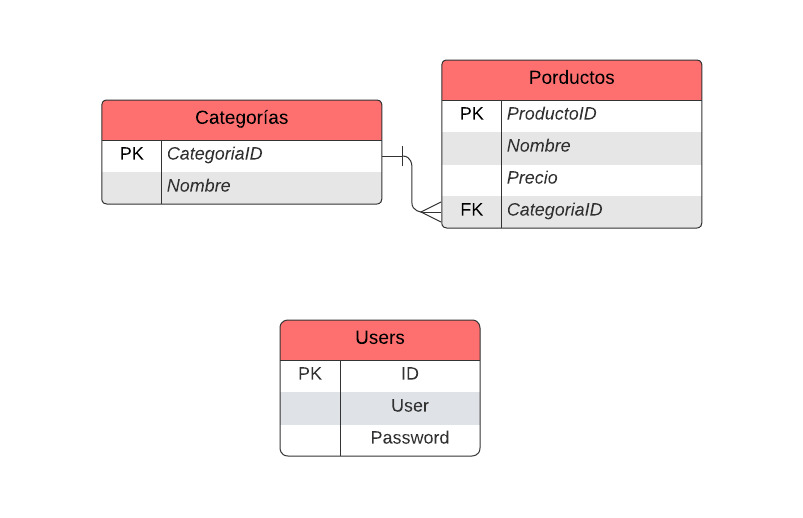

Integrantes:
    -Francisco Parra 98franciscoparra@gmail.com
    -Valentin Jurado valentinjuradojurado@gmail.com

Tematica:
Comercial

Descripcion:
En este trabajo creamos una base de datos llamada "comercial" usando phpMyAdmin en el que creamos dos tablas, "productos" y "categorias", que se relacionan para ayudarnos a organizar los datos. La tabla "productos" tiene informacion sobre cada producto y la tabla "categorias" tiene una columna para el nombre de dicha categoria y otra que almacena el ID, el cual nos ayuda a buscar los productos por categoria 

Diagrama de entidad relación:

